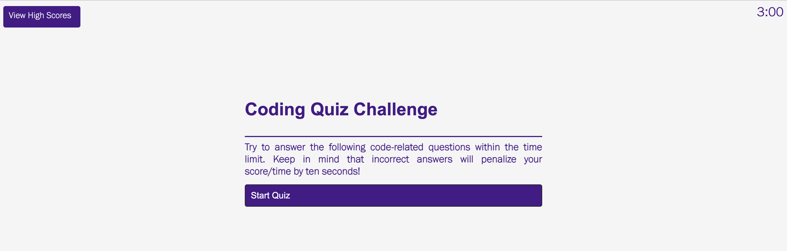
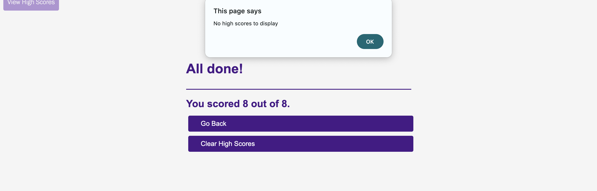
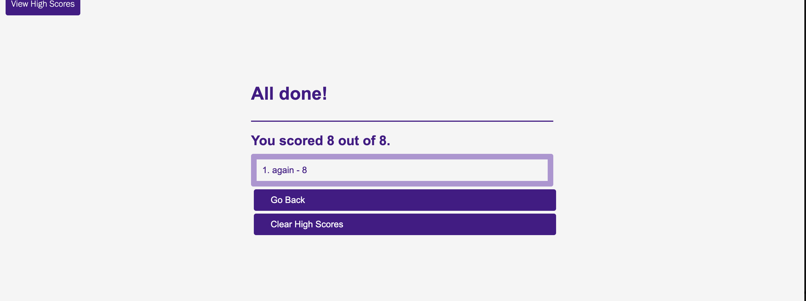
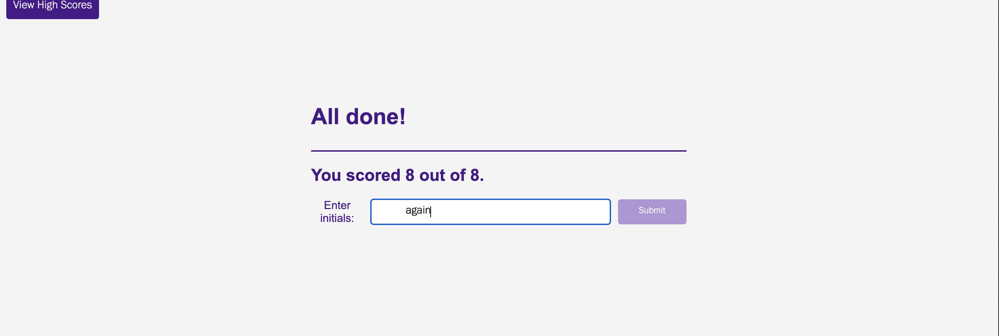
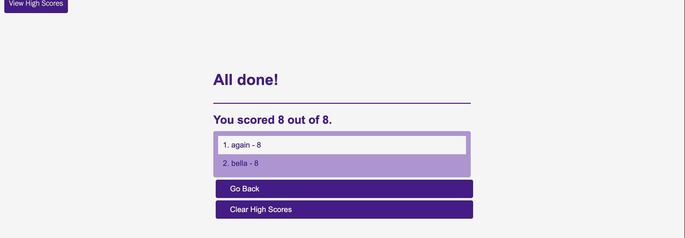

# **Web API's Challenge: Code Quiz**

The purpose of this project was to create a full coding quiz assessment in JavaScript, a project we might face in a real world interview process. A coding assessment is the combination of multiple-choice questions and interactive coding challenges.

We were to build a timed coding quiz with multiple choice questions, that will run in a browser, feature dynamically updated HTML and CSS powered by written JavaScript code. It will be clean, polished, and responsive user interface. This is part of a common technical interview practice and the level of difficulty of the questions will increase with skill.

I began by doing research and finding sources -- these youtube videos were equally helpful in various partys of the assignment.

Sources: https://www.youtube.com/watch?v=PBcqGxrr9g8, https://www.youtube.com/watch?v=f4fB9Xg2JEY 

I followed the videos to create the Javascript, HTML, and CSS. Here is a screen recording video of it:

[ScreenVideoRecording](https://vimeo.com/925599878)

But for reference, here are some screenshots of the flow of the quiz below. Here's the first page that loads when you click on the quiz:

I added a cool feature where if there are no high scores available in local storage, it calls an error message. If there are actual scores stored in the local storage, it calls these results when the quiz first loads and afterwards.

Lastly, when you finish the quiz, it lets you submit your name.

Lastly, you can see the final results here at the end too.

In conclusion: I set up the quiz to have a Start Quiz page, click on the Start button, go through the quiz where: 

- the high scores are visible when the page first loads if there are any stored in localStorage, or if there are none, the user receives an error message
- the quiz answers change color when you hover over them
- they change green/red if you get one correct/incorrect, and also are labelled as such below the options
- the quiz is timed, and you lose time if you get an answer wrong
- if you go back, the timer shows up and restarts at the beginning as well
- after you finish the quiz, you are directed to a submit initials page where you can type in your name, and hit submit
- you then see the high scores results
- you can hit the 'go back' button, then hit the 'view high scores' link, where you can see the same results
- you can clear the high scores results if the user wishes

The hardest part was just navigating through the JavaScript and making sure everything was labelled correctly. It was a lot of troubleshooting and trying to figure out why something wasn't working, but I did eventually get everything down pact.

Please follow this link to the successful, full deployed video on GitHub: https://szolton.github.io/04-Challenge-Week4-Coding-Quiz/
